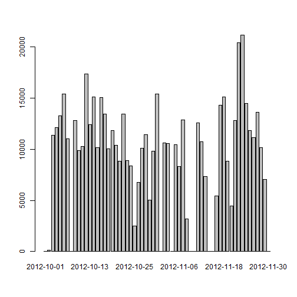
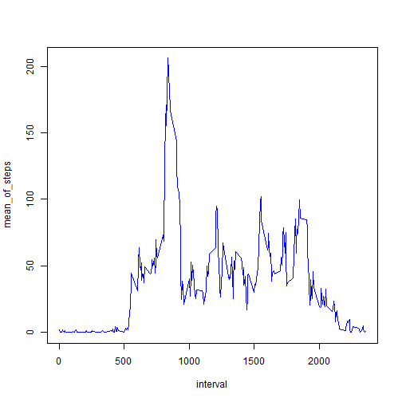
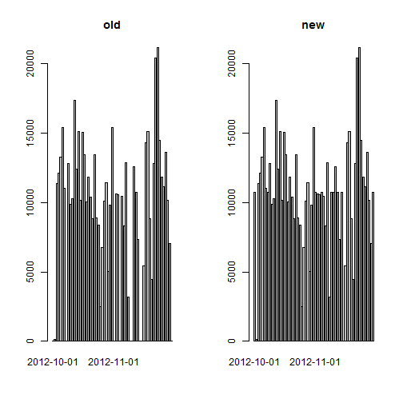

## 1.Loading and preprocessing the data

```r
activity <- read.csv("activity.csv")
head(activity)
```

```
##   steps       date interval
## 1    NA 2012-10-01        0
## 2    NA 2012-10-01        5
## 3    NA 2012-10-01       10
## 4    NA 2012-10-01       15
## 5    NA 2012-10-01       20
## 6    NA 2012-10-01       25
```

## 2.What is mean total number of steps taken per day?
Here I call function ```aggregate``` to count steps by per day

```r
steps_per_day <- aggregate(activity$steps, by=list(activity$date), FUN=sum, na.rm=TRUE) #main code
names(steps_per_day) <- c('date', 'steps')  #assign column names
head(steps_per_day)
```

```
##         date steps
## 1 2012-10-01     0
## 2 2012-10-02   126
## 3 2012-10-03 11352
## 4 2012-10-04 12116
## 5 2012-10-05 13294
## 6 2012-10-06 15420
```


Then create a histogram :

```r
barplot(steps_per_day$steps, names.arg=steps_per_day$date)
```

 


Finally, get the mean and median of steps taken per day:

```r
mean(steps_per_day$steps)
```

```
## [1] 9354.23
```

```r
median(steps_per_day$steps)
```

```
## [1] 10395
```

## 3.What is the average daily activity pattern?
Also, use ```aggregate``` function to achieve the goal of averaging steps by time series

```r
means_per_interval <- aggregate(activity$steps, by=list(activity$interval), FUN=mean, na.rm=TRUE) # main code
names(means_per_interval) <- c("interval", "mean_of_steps") # assign column names
head(means_per_interval)
```

```
##   interval mean_of_steps
## 1        0     1.7169811
## 2        5     0.3396226
## 3       10     0.1320755
## 4       15     0.1509434
## 5       20     0.0754717
## 6       25     2.0943396
```


Then draw a line chart with x="time interval" and y="averaged steps"

```r
plot(x=means_per_interval$interval, y=means_per_interval$mean_of_steps, type="l", col="blue", xlab="interval", ylab="mean_of_steps")
```

 


And the max averaged steps is:

```r
max <- which.max(means_per_interval$mean_of_steps) # find the max steps, and return row_number/index
means_per_interval[max, "interval"]
```

```
## [1] 835
```


## 4.Imputing missing values

```r
sum( is.na(activity$steps)==TRUE )
```

```
## [1] 2304
```


The strategy I use to fill missing values is to fill NAs with "mean for 5-minute interval"(M5MI)
Thus, first I create a new dataset:

```r
new.activity <- read.csv("activity.csv")
```


Second, find which row has NAs(missing value) on the "steps" column:

```r
na_rows <- which(is.na(new.activity$steps) )
head(na_rows)   #row_number indicates where is NA
```

```
## [1] 1 2 3 4 5 6
```


Finally, assign M5MI(mean for 5-minute interval) to NA

```r
for (i in 1:length(na_rows)){
    index <- which( means_per_interval$interval == new.activity[na_rows[i], "interval" ] )
    new.activity[na_rows[i], "steps"] <- means_per_interval[index, "mean_of_steps"]
}
```

```r
table(is.na(new.activity$steps))
```

```
## 
## FALSE 
## 17568
```


Now, plot a historgam again to compared with the previous hist and results:

It seems different: some days originally have nothing but now are filled. 

```r
new.steps_per_day <- aggregate(new.activity$steps, by=list(new.activity$date), FUN=sum) #count steps by date
names(new.steps_per_day) <- c('date', 'steps')  #assign column names
par(mfrow=c(1,2))
#old
barplot(steps_per_day$steps, names.arg=steps_per_day$date, main="old")
#new
barplot(new.steps_per_day$steps, names.arg=new.steps_per_day$date, main="new")  
```

 


And the mean and median:

```r
old_mean <-   mean(steps_per_day$steps)
old_median <- median(steps_per_day$steps)
new_mean <-   mean(new.steps_per_day$steps)
new_median <- median(new.steps_per_day$steps)

c(old_mean, new_mean)
```

```
## [1]  9354.23 10766.19
```

```r
c(old_median, new_median)
```

```
## [1] 10395.00 10766.19
```

Since we replaces NAs with M5MI, the mean and median are definitely changed! 


## 5.Are there differences in activity patterns between weekdays and weekends?
Create a new varable 'weeklevel' contains 2 factors("weekday", "weekend")

```r
new.activity$date <- as.Date(new.activity$date, "%Y-%m-%d")
    
weeks <- weekdays(new.activity$date)
daylevel <- vector()

for (i in 1:length(weeks)){
    if( (weeks[i]=="Sunday") | (weeks[i]=="Saturday") ){
        daylevel[i] <- "weekend"
    }
    else{
        daylevel[i] <- "weekday"
    }
}
```

```r
new.activity$weeklevel <- factor(daylevel)
head(new.activity)
```

```
##       steps       date interval weeklevel
## 1 1.7169811 2012-10-01        0   weekday
## 2 0.3396226 2012-10-01        5   weekday
## 3 0.1320755 2012-10-01       10   weekday
## 4 0.1509434 2012-10-01       15   weekday
## 5 0.0754717 2012-10-01       20   weekday
## 6 2.0943396 2012-10-01       25   weekday
```


Similarly, use ```aggregate``` function to calculate means, but this time by 'interval' and 'weeklevel' 

```r
meanSteps_by_interval_week <- aggregate(new.activity$steps, by=list(new.activity$interval, new.activity$weeklevel), FUN=mean) 
names(meanSteps_by_interval_week) <- c("interval", "weeklevel", "steps") #assign column names
```


In the end, use Lattice plotting system to draw a line chart 

```r
library(lattice)
xyplot(steps ~ interval | weeklevel, meanSteps_by_interval_week, layout = c(1, 2), type = "l", xlab="Interval", ylab="Number of steps")
```

 


